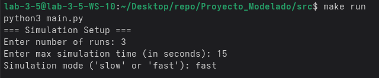
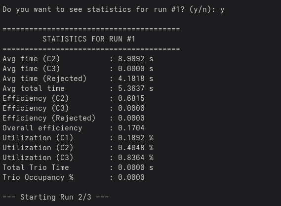
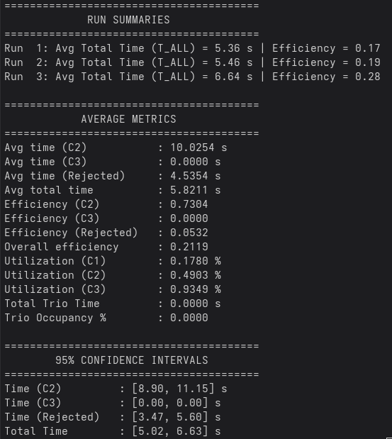

# Metodos de Modelado y Optimización: Proyecto II Etapa

## Integrantes

Grupo: Maruchan

- Aaron Arce Alfaro (C30601)
- Jerson Bonilla Fernández (C31225)
- Esteban Solis Alfaro (C37670)
- Aron Venegas Muñoz (C38395)

## Descripción

Este proyecto simula un sistema con tres computadoras (C1, C2, C3) que procesan mensajes utilizando simulación por eventos discretos. El modelo incluye:

- LLegada de mensajes
- Tiempos de procesamiento
- Gestión de colas
- Decisiones probabilísticas de enrutamiento

Para acceder al problema resuelto en este programa puede acceder a este en `doc/CI0130_Proyecto_Simulacion.pdf`.


## Dependencias

1. Python3:

- Para Ubuntu/Debian: `sudo apt install python3`

- Para Fedora: `sudo dnf install python3`

2. Make

## Para ejecutar

En el directorio `src/` abra una terminal capaz de utilizar le comando `make` y utilice el siguiente comando

```bash
make run
```

Este comando utilizará el makefile provisto y ejecutará el programa.

## Utilización

Al iniciar, el programa le solicitará al usuario los siguientes argumentos para la simulación:

- `Number of runs`: Numero de corridas que tendrá la simulación. Debe ser un número entero.

- `Max simulation time`: Tiempo máximo que tendrá la simulación en segundos. Debe ser un número entero.

- `Simulation mode`: Modificador de velocidad en la que la simulación se muestra al usuario puede ser "slow" o "fast".

- En caso de brindar una entrada invalida el programa utilizará los siguiente valores por defecto e iniciará la simulación:

- `Number of runs`: 5
- `Max simulation time`: 100
- `Simulation mode`: fast

Entre runs el programa le preguntará al usuario si desea ver las estadísticas de tal corrida, a lo que este podra contestar "y" o "n". En caso de una entrada inválida simplemente no se mostrarán las estadísticas.

## Ejemplos de ejecución

- Ejemplo de argumentos válidos:



- Ejemplo de programa en plena simulación:


- Ejemplo de estadisticas entre corridas:



- Ejemplo de resultados finales generales:


